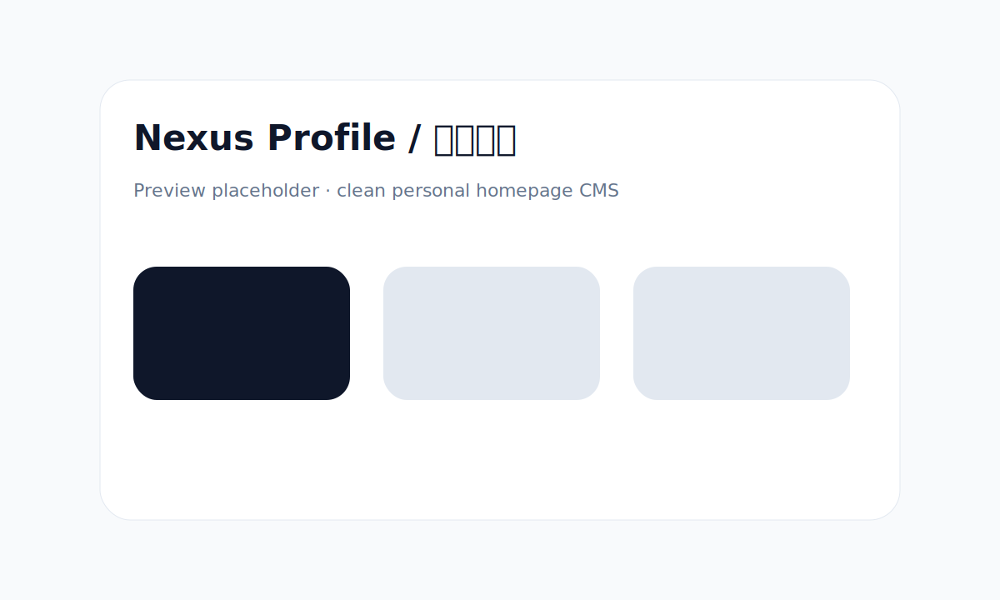

# Nexus Profile / 星枢主页

A modern, minimal, front-end/back-end separated personal homepage and navigation CMS.

Repository: <https://github.com/cshaizhihao/nexus-profile>

> Status: Phase 0/1 scaffold in progress. Preview screenshots will be added after the first visual milestone.

## Features

- Vue 3 + Vite + TypeScript frontend
- Vue Router based multi-page structure, no one-page waterfall layout
- Fastify + Prisma backend API
- CMS-ready site configuration, navigation categories, links and asset upload model
- Custom CSS injection support
- Local icon upload and external icon URL support
- Docker Compose deployment
- VPS one-command install script

## Preview



## Default Ports

- Frontend: <http://127.0.0.1:10080>
- Backend API: <http://127.0.0.1:10081>
- Public no-port preview: <http://208.115.216.131/>
- Public API via Nginx: <http://208.115.216.131/api/site-config>

## Development

```bash
# Backend
cd backend
cp .env.example .env
npm install
npm run prisma:migrate
npm run dev

# Frontend
cd ../frontend
npm install
npm run dev
```

## Docker Deployment

```bash
cp .env.example .env
docker compose up -d --build
```

The frontend container serves the built SPA and proxies `/api/` plus `/uploads/` to the backend container.

## VPS One-command Install

```bash
bash install.sh
```

## Project State

See [PROJECT_STATE.md](./PROJECT_STATE.md) for progress, completed tasks, todo list and environment notes.

## CMS Capabilities

- Edit homepage title, subtitle, description, avatar, background and custom CSS.
- Create, edit and delete navigation categories.
- Create, edit and delete navigation links.
- Upload local images for avatars and link icons.
- Use external image URLs when preferred.

## Current VPS Production Notes

The live preview currently uses the existing server-level Docker Nginx default entry. Static frontend files are served from `/home/web/html/nexus-profile`, while `/api/` and `/uploads/` proxy to the Node backend on `127.0.0.1:10081`.

Production deploy helper:

```bash
bash scripts/deploy-production.sh
```
